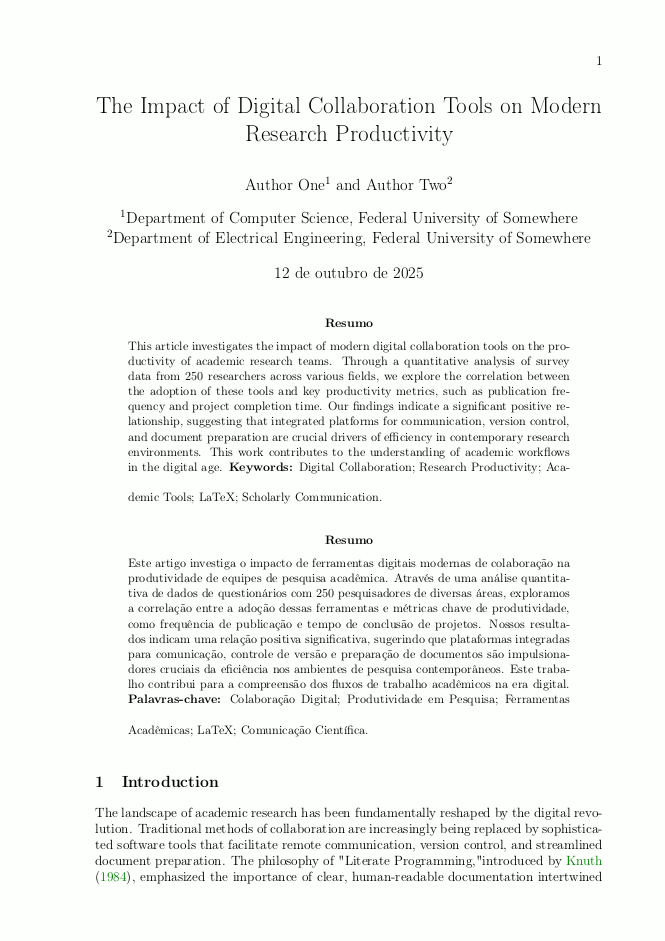

# LaTeX Template for Academic Articles



This project provides a clean, modern, and flexible LaTeX template designed for academic articles, scientific papers, and conference submissions. It is built using the standard `article` class and enhanced with packages for professional typography, citation management, and a structured layout.

## Key Features

* **Modern & Clean Typography**: Configured for readability with standard margin settings and professional font handling.
* **Professional Tables**: Includes the `booktabs` package [cite: 12] for creating publication-quality tables without vertical lines.
* **Flexible Author Block**: Uses `authblk` to easily manage multiple authors and their affiliations[cite: 16].
* **Pre-configured Code Listings**: The `listings` package is set up with a clean style for displaying source code snippets.
* **Powerful Bibliography Management**: Integrated with `natbib` for flexible author-year citations[cite: 12].
* **Hyperlinked PDF**: The `hyperref` package is configured to produce a PDF with clickable internal links (sections, figures) and external URLs.
* **Full Appendix and Attachment Support**: Uses the `appendix` package to correctly format appendices (`Appendix A`, `Appendix B`) and attachments (`Attachment A`, etc.)[cite: 13, 33, 34, 37].
* **Easy Cleanup**: A `Makefile` is included with a `clean` command to remove all temporary files generated by LaTeX[cite: 1, 3].

---

## File Structure

The project has a minimal and flat structure, making it easy to get started:

```bash
.
├── Makefile
├── README.md
├── main.tex
└── references.bib
```

- main.tex: The main file where you write your article's content. All configuration and metadata (title, author, etc.) are at the top of this file.
- references.bib: The BibTeX database file for all your citations.
- Makefile: A utility script to help clean the project directory.
- README.md: This file.

## Prerequisites

- A full LaTeX distribution, such as TeX Live, MiKTeX, or MacTeX.

## How to Use

1. Configure Your Article: Open main.tex and fill in your article's information in the ARTICLE METADATA section:

    ```latex
    \title{Your Title Here}
    \author[1]{Your Name}
    \affil[1]{Your Affiliation}
    \date{\today}
    ```

2. Write Your Content:
    - Edit the abstract and keywords.
    - Write the main body of your paper within the predefined \section and \subsection commands.
    - Add appendices or attachments as needed in the post-textual elements section.

3. Add Citations: Add your bibliographic entries to the `references.bib` file. You can cite them in the text using `\citet{key}` for textual citations (e.g., "Author [Year]") and `\citep{key}` for parenthetical citations (e.g., "(Author, Year)").

4. Compile the Document: The recommended way to compile is with latexmk, which automatically handles the multiple passes needed for bibliography and references.

    ```bash
    latexmk -pdf main.tex
    ```

5. Clean Up: To remove all auxiliary files (.aux, .log, .bbl, etc.), run the clean command:

    ```bash
    make clean
    ```

## Customization

#### Citation Style

The template uses the natbib package with the [round,authoryear] options. You can easily change this. For numeric citations, for example, you could change the package import to:

```latex
% From:
\usepackage[round,authoryear]{natbib}
% To:
\usepackage[square,numbers]{natbib}
```

You will also need to switch to a suitable numeric `bibliographystyle`, such as `plain`.

#### Margins and Layout

Page margins can be adjusted by modifying the options in the geometry package import at the top of `main.tex`.

#### Colors

The hyperlink colors are defined in the `hypersetup` block. You can change the `linkcolor`, `citecolor`, and `urlcolor` values to match your preferences.